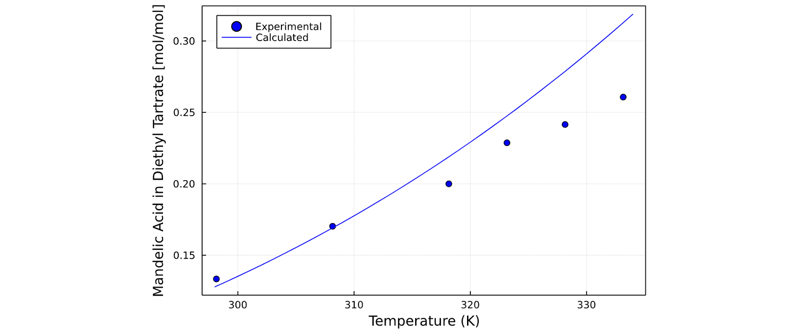
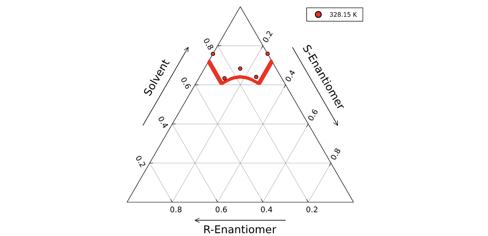

[](https://github.com/RGambarini/SolMod.jl/actions)
[](http://codecov.io/github/RGambarini/SolMod.jl?branch=main)
[](https://RGambarini.github.io/SolMod.jl/dev)


**SolMod.jl** is a [Julia](http://julialang.org) package used for the prediction of solubility with the focus on creating ternary phase diagrams for pharmaceutical solubility of enantiopure drugs.

# Installing SolMod

To install SolMod, launch Julia with

```julia
> julia
```

Hit the ```]``` key to enter Pkg mode, then type

```julia
Pkg> add https://github.com/RGambarini/SolMod.jl#main
```

Exit Pkg mode by hitting backspace.

Once SolMod.jl is installed, it can be loaded using:

```julia
using SolMod
```

If we want to predict a solubility curve for the single enantiomer we can use the following command:

```julia
NRTL_solubilityCurve(params, [298, 334], "Solvent", guess = 0.12, components = 3)
```



We can also calculate ternary phase solubility for a mixture of enantiomers. We start by defining the method we will use to calculate the activity coefficient as a function:

```julia
γi() = NRTL_activityCoefficient(params, "Solvent", 328.15)
γj() = NRTL_activityCoefficient(params, "Solvent", 328.15, e = false)
```

Then we feed use it to calculate the solubility at every possible composition of the mixture:

```julia
ternaryPhase(params, γi, γj, 328.15)
```



To remove the package, hit the ```]``` key to enter Pkg mode, then type

```julia
Pkg> rm SolMod
```

## Package in active Development

Note that at its current stage, SolMod is still in the early stages of development, and things may be moving around or changing rapidly.

If you find any issue, feel free to contact me directly through my [email](mailto:rag21@imperial.ac.uk), or open a Github issue. 