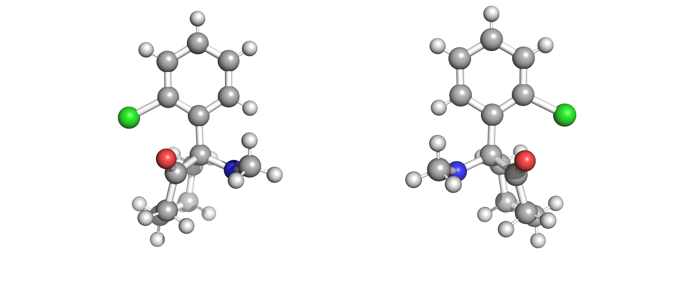

# Background

The focus on enantiopure drugs has forced the pharmaceutical industry to look for cost efficient methods of production. These methods are required to be efficient enough to separate the enantiomeric target from a racemic mixture. One way that this has been achieved is through the direct crystallisation in a racemic mixture. This stochastic process is poorly understood and leads to long and costly experiments. To improve upon this randomness, mathematical models can be developed to predict the thermodynamic values from the separation process. These models look to reduce the experimental time necessary for solubility diagrams. This project was made in collaboration with Imperial College London's [Institute of Molecular Science and Engineering](https://www.imperial.ac.uk/molecular-science-engineering/) and [BASF](https://www.basf.com). The goal was to develop a software to model solubility diagrams of enantiomers.

Asymmetrical crystallisation of a chemical molecule can be traced back to experiments performed by Arago and Biot in 1811. This experiment showed different rotations of polarised light on cut crystals. This was later reinforced on organic products, where similar results were shown [[1]](https://www.cairn-int.info/article-E_RHS_662_0395--arago-biot-and-fresnel-elucidate.htm). The study of stereochemistry is formally attributed to Louis Pasteur, who in 1848 detected different crystal structures after the crystallising the racemic sodium ammonium salt of tartaric acid. Like Arago and Biot, he also saw that light rotated differently on these crystals [[2]](https://ci.nii.ac.jp/ncid/AA00612512?l=en). The key discovery was presented by Van 't Hoff and Le Bel during independent research experiments. What awarded Henry Van’t Hoff the first ever Nobel prize in Chemistry was detailing the relationship between three-dimensional molecular structure and optical activity and the concept of the asymmetric carbon atom [[3]](https://books.google.co.uk/books?hl=en&lr=&id=KiN5Dw3osfoC&oi=fnd&pg=PA1&dq=Hoff+JH.+Voorstel+tot+uitbreiding+der+tegenwoordig+in+de+scheikunde+gebruikte+structuur-formules+in+de+ruimte:+benevens+een+daarmee+samenhangende+opmerking+omtrent+het+verband+tusschen+optisch+actief+vermogen+en+chemische+constitutie+van+organische+verbind&ots=RAqUSssea5&sig=A50dBWEkcYiODoiZe48sH0_AhPE&redir_esc=y#v=onepage&q&f=false)[[4]](http://itis.arezzo.it/documenti/pdf/risorsedidattiche/documento_vant_hoff_in_inglese.pdf).

[Stereoisomers](https://en.wikipedia.org/wiki/Stereoisomerism) are molecules that have both the same molecular formula and connectivity but differ in their three-dimensional arrangement. Stereoisomers can be either diastereomers or enantiomers. Diastereomers have different arrangement of atoms that cannot be optically rearranged to form the counterpart. Enantiomers are mirrored non-superposable molecules that could be rearranged via a chiral shift to form the opposite. The standard nomenclature is the R/S system, used to identify distinct enantiomers. 

Enantiomeric molecules will share the same chemical and physical properties in solution which make them indistinguishable components. In biological systems the function of a protein is determined by its shape, and the shape of a protein can be defined by its amino acid components. 19 out of the 20 amino acids that naturally occur in nature are enantiomers, and only the S enantiomers are used for protein synthesis [[5]](https://www.sciencedirect.com/science/article/pii/S0021967307021164?casa_token=HT_EmntXgdQAAAAA:kmiQCTI1XDI7PoZwF9lVZ2NuktUXcNfnx-dWIgMJM0MweQZpxjU05Bt9U149dhB74wmi5KV-Si_R). This exclusivity extends to pharmaceuticals. Omeprazole (also known as Prilosec) has been used for years as a medication for gastrointestinal diseases. This drug is the crystal product of both enantiomers of omeprazole, commonly known as the racemate. In the treatment of gastrointestinal symptoms, only the S-enantiomer will have any medicinal properties. The R-enantiomer won’t have the effect of its mirror molecule until it has produced a chiral shift in vivo. The more challenging example is that of salbutamol (also known as albuterol) which is an enantiomeric drug that is used to treat asthma and asthma attacks. R-salbutamol causes the opening of airways in the lungs, but its mirror enantiomer produces a variety of unpleasant side-effects. This apparent limitation has pushed the industry to develop enantiopure drugs, or enantiomeric drugs of only one enantiomer. In the case of omeprazole, even though its pharmacological benefits are still debated, there is no doubt that it has been a financial success [[6]](https://link.springer.com/article/10.1186/s40199-015-0133-6) [[7]](https://onlinelibrary.wiley.com/doi/pdf/10.1111/jpim.12196?casa_token=bN5kK_aUBoQAAAAA:ZqHZDOGg-dmIS581pqjYthb1olg3cGwaq8f7jqajmJPaADGErxnT-dgkcfMs_9bXAl6Vzj7Owq7-BCHnWg).

The symmetrical properties of enantiomers in solution makes the separation of these components a challenge. To synthesize enantiopure medications, the product needs to be purely composed of our desired enantiomer crystal. In very few cases the process is very simple and chiral pooling, or a chiral catalyst can be used [[8]](https://onlinelibrary.wiley.com/doi/pdfdirect/10.1002/anie.200330072?casa_token=q0iuObmo038AAAAA:pRl6EsAJdRjQpPSv-VwHDzgBLyE37zx_e2pgYKmWE79pzHbHXs--kByUtxN06h1R-zLDOr-5um7Uk194Fg). The most common procedure to separate enantiomeric molecules is to use the racemic method. In which you use chiral mobile phase additives to resolve a racemate into a pure enantiomer or you utilise a chiral derivatizing agent for enantioseparation. Either process is costly and time-consuming but have been consistently used in the pharmacological industry [[9]](https://pubs.rsc.org/en/content/articlehtml/2016/ay/c6ay02015a?casa_token=r7nrprUNu28AAAAA:m7HOkUPoMxmsrWFI5o70XlaHx3hv1RH9mLMRVffw4GEtbyNCpjo5R6GTsVAlyJ0Nfopn-D4iJ-MsA5ij). These methods have been successful in both small processes and in batch processes but haven’t been thoroughly researched in continuous processes. There are some obvious economic benefits to transitioning to continuous processes. This lucrative opportunity interests pharmaceutical companies that want to maximise their production while keeping costs low. Therefore, one method that can be considered is the direct crystallisation of one enantiomer in a racemic mixture [[10]](https://www.sciencedirect.com/science/article/pii/S0021967300009924?casa_token=_Ejlum3lDIMAAAAA:81oUBZ3pF3aS9EmhQaZlxcOjuL794gl3w48iGRYCNN8rMYMlELqz0sp_EQVpROMjvuNPPuxuuYPL). This process achieves enantiospecific crystallization by modulating the concentration of the solutes. By saturating the solution of a mixture with one of the solutes, only the seeded component will crystalize, leaving only the opposite enantiomer in the solution. In a mixture of enantiomers, crystallization can occur in two ways. In conglomerates, crystallization occurs independently while racemic compounds produce a racemate crystal at certain compositions. 90% of enantiomeric mixtures will crystalise as racemic compounds and produce a racemate, which means solubilities are complex to determine [[11]](https://pubs.rsc.org/en/content/ebook/978-1-78801-214-0).

Knowledge of the points of solubility, as a function of their temperature and composition, is essential to produce enantiopure products from a racemic compound. These experiments require extensive trial-and-error results that are both costly and time-consuming. The process is also solvent-solute specific, so the process needs to be repeated across any combination of components. To circumvent this requirement, we can develop a thermodynamic model in order to predict the possible solubility values. Solubility of a binary system can be predicted using the equations put forth by Schröder and van Laar [[12]](https://agris.fao.org/agris-search/search.do?recordID=US201300332512). The ideal solubility of a compound ($x_i^{sat}$) in a solution can be calculated by knowing the compound’s calorimetric properties ($Δ_{fus}H_i, T_m$) and the activity coefficient ($\gamma_i^L$). This equation is simplified from the relationship between the activity coefficient and fugacity in the liquid phase. The calorimetric properties of a solute can be easily determined and used irregardless of the solvent.

``f^L_i &= f^S_i \tag{1}``
``f^L_i &= f^{L,0}_ix^{sat}_iγ^L_i \tag{2}``
``ln\dfrac{f^L_i}{f^{L,0}_i} &= ln(x^{sat}_iγ^L_i) \tag{3}``
``ln(x^{sat}_iγ^L_i) & = \dfrac{Δ_{fus}H_i}{RT}(\dfrac{T}{T_{m,i}} - 1) + \dfrac{Δc_{p, i}}{R}(\dfrac{T_{m,i}}{T} - 1) + \dfrac{Δc_{p, i}}{R}(-ln(\dfrac{T_{m,i}}{T})) \tag{4}``
``ln(x^{sat}_iγ^L_i) & = \dfrac{Δ_{fus}H_i}{R}(\dfrac{1}{T_{m,i}} - \dfrac{1}{T}) \tag{5}``
\

The activity coefficient of a non-ideal mixture must be computed using thermodynamic models. Traditionally, empirical methods have been used to determine the activity coefficient. Empirical models such as Wilson, NRTL (Non-random two liquid), UNIQUAC (Universal Quasichemical), etc., have been successfully used in industry to model pharmaceutical solubility [[13]](https://www.academia.edu/download/72909788/JASCMV4N3A2-Salimi.pdf). These equations are dependent on interaction parameters derived from experimental research. Once obtained, the unique solute-solvent parameters can be used in any composition at a broad temperature range. Completely predictive models have also been used to determine the activity coefficient with limited success. The required information can be determined by either quantum calculations using COSMO-RS (Conductor like Screening Model for Real Solvents) or equations of state such as PC-SAFT (Perturbation-Chain Statistical Associating Fluid Theory). Both methods will yield an acceptable activity coefficient, but their use is considered less reliable compared to empirical models if the experimental data is available [[14]](https://onlinelibrary.wiley.com/doi/pdf/10.1002/jps.21032?casa_token=6HrdhQaqmZgAAAAA:MbKV4_rJabCISLN8jq5CLo4YfljIYg8GyGjVHNFMdI9oU1O2ytyQSVoXvrsUUriCYK8tjP3QwzCldOvXQA). Recently, modifications to the empirical methods have yielded semi-empirical formulations that attempt to minimize error. Predominantly, this comes as the SAC modification (Segment Activity Coefficient), where the molecule’s surface interactions are divided in segments and each type of solute-solvent interaction (hydrophobic, hydrophilic, and polar) has been predefined.

The solubility data of enantiomeric mixtures is easily interpreted using a ternary phase diagram. In this three-variable chart, every point represents a composition of the R/S enantiomer and the solvent of the solution. The Schröder and van Laar equation allows for the solubility lines of the enantiomers to be calculated. This is the case for conglomerates, but in most situations the mixture will behave as a racemic compound, where the racemate must be accounted for. Like single enantiomers, we require the activity coefficient of the racemate to model solubility. An expansion of the Schröder and van Laar equation leads to a modified Prigogine and Defay equation [[15]](http://hdl.handle.net/2013/ULB-DIPOT:oai:dipot.ulb.ac.be:2013/251771) [[16]](https://pubs.acs.org/doi/pdf/10.1021/je900353b?casa_token=0zrxAThReXgAAAAA:9edI4d4G6AOwxFXnumUeRusQMVn-DMYY_64aV9q7xIBtyOZXeAYLAHAJzuP44pVmebtNsoURydLtNiX5GQ). This relationship can be used to determine the solubility point of the racemate with the activity coefficient of the constituent enantiomers. This allows for the calculation of the racemate solubility curve and determining the eutectic points of the solution. Knowing the eutectic points gives us enough information to design a process where we can produce one kind of crystal enantiomer.

 <em>Ternary phase diagrams for a conglomerate (Left) and for a racemic compound (Right). Components in the solid phase are tagged with (s), while components in the liquid phase are group under L. RS refers to the racemate in the racemic compound.</em>
\

``
        dG &= (\dfrac{\partial G}{\partial T})_{p,n}\space dT + (\dfrac{\partial G}{\partial p})_{T,n}\space dp + ∑\mu_idn_i \tag{1} \\
        -(\dfrac{\partial G}{\partialζ})_{T,p} &= A \tag{2} \\
        A &= \mu^S_{rac} - v_i\mu^L_{i} + v_j\mu^L_{j} \tag{3} \\
        d(\dfrac{A}{T}) &= \dfrac{H}{T^L}dT - \dfrac{V}{T}dp+\dfrac{1}{T}(\dfrac{\partial A}{\partial x})_{T,p}dx \tag{4} \\
        d(A) &= \dfrac{A + H}{T}dT+(\dfrac{\partial A}{\partial x^L_j})_{T,p}dx_j^L \tag{5} \\
        \dfrac{\partial A}{\partial x^L_j} &= v_i ⋅ (\dfrac{x^L_j}{x^L_i} - \dfrac{v_j}{v_i}) ⋅\dfrac{\partial \mu^L_j}{\partial x^L_j} \tag{6} \\
        \dfrac{\partial T}{\partial x^L_j} &= - \dfrac{v_iT ⋅ (\dfrac{x_j^L}{x_i^L} - \dfrac{v_j}{v_i}) ⋅ \dfrac{\partial \mu^L_j}{\partial x^L_j}}{H} \tag{7} \\
        \mu &= \mu^∘(p, T) + RT \space ln \space x \tag{8} \\
        (\dfrac{\partial \mu^L_j}{\partial x^L_j})_{T, p} & = \dfrac{RT}{x^L_j} \tag{9} \\
        (\dfrac{v_j}{x_j} - \dfrac{v_i}{x_i})\partial x_j &= \dfrac{H}{RT^2}\partial T \tag{10} \\
        -ln \dfrac{x_ix_j}{0.25} &= \dfrac{Δ_{fus}H_{rac}}{R}(\dfrac{1}{T} - \dfrac{1}{T_{m, rac}}) \tag{11} \\
        ln \space 4 \space x_ix_j &= \dfrac{Δ_{fus}H_{rac}}{R}(\dfrac{1}{T_{m, rac}} - \dfrac{1}{T}) \tag{11} \\
        ln \space [4 \space x_i^{sat}\gamma^L_ix_j^{sat}\gamma^L_j] &= \dfrac{Δ_{fus}H_{rac}}{R}(\dfrac{1}{T_{m, rac}} - \dfrac{1}{T}) \tag{12} \\
``\

#### References

[1] Leclercq F. Arago, Biot, and Fresnel Elucidate Circular Polarization. Revue dhistoire des sciences. 2013;66(2):395-416.\
[2] Pasteur L. Memoires sur la relation qui peut exister entre la forme crystalline et al composition chimique, et sur la cause de la polarization rotatoire. Compt. rend.. 1848;26:535-8.\
[3] Hoff JH. Voorstel tot uitbreiding der tegenwoordig in de scheikunde gebruikte structuur-formules in de ruimte: benevens een daarmee samenhangende opmerking omtrent het verband tusschen optisch actief vermogen en chemische constitutie van organische verbindingen. Greven; 1874.\
[4] Le Bel JA. On the relations which exist between the atomic formulas of organic compounds and the rotatory power of their solutions. Bull. Soc. Chim. 1874;22:337-47. \
[5] Bertrand M, Chabin A, Brack A, Westall F. Separation of amino acid enantiomers VIA chiral derivatization and non-chiral gas chromatography. Journal of Chromatography A. 2008 Feb 8;1180(1-2):131-7.\
[6] Asghar W, Pittman E, Jamali F. Comparative efficacy of esomeprazole and omeprazole: Racemate to single enantiomer switch. DARU Journal of Pharmaceutical Sciences. 2015 Dec;23(1):1-7.\
[7] Conley JG, Bican PM, Ernst H. Value articulation: a framework for the strategic management of intellectual property. California Management Review. 2013 Jul;55(4):102-20.\
[8] Hawkins JM, Watson TJ. Asymmetric catalysis in the pharmaceutical industry. Angewandte Chemie International Edition. 2004 Jun 21;43(25):3224-8.\
[9] Mane S. Racemic drug resolution: a comprehensive guide. Analytical Methods. 2016;8(42):7567-86.\
[10] Lorenz H, Sheehan P, Seidel-Morgenstern A. Coupling of simulated moving bed chromatography and fractional crystallisation for efficient enantioseparation. Journal of Chromatography A. 2001 Jan 26;908(1-2):201-14.\
[11] Lorenz H, Temmel E, Seidel-Morgenstern A. Continuous Enantioselective Crystallization of Chiral Compounds. InThe Handbook of Continuous Crystallization 2020 Feb 4 (pp. 422-468).\
[12] Jacques J, Collet A, Wilen SH. Enantiomers, racemates, and resolutions. Wiley; 1981.\
[13] Salimi M, Zarenezhad B, Fakhraian H, Choobdari E. Thermodynamic modeling of chiral compounds solubility using Correlative and predictive models. Journal of Applied Solution Chemistry and Modeling. 2015 Jul 1;4(3):143.\
[14] Tung HH, Tabora J, Variankaval N, Bakken D, Chen CC. Prediction of pharmaceutical solubility via NRTL-SAC and COSMO-SAC. Journal of Pharmaceutical Sciences. 2008 May 1;97(5):1813-20.\
[15] Prigogine I, Defay R. Chemical thermodynamics. Norwich: Jarrold & Sons. 1958.\
[16] Tulashie SK, Kaemmerer H, Lorenz H, Seidel-Morgenstern A. Solid− liquid equilibria of mandelic acid enantiomers in two chiral solvents: experimental determination and model correlation. Journal of Chemical & Engineering Data. 2010 Jan 14;55(1):333-40.\
