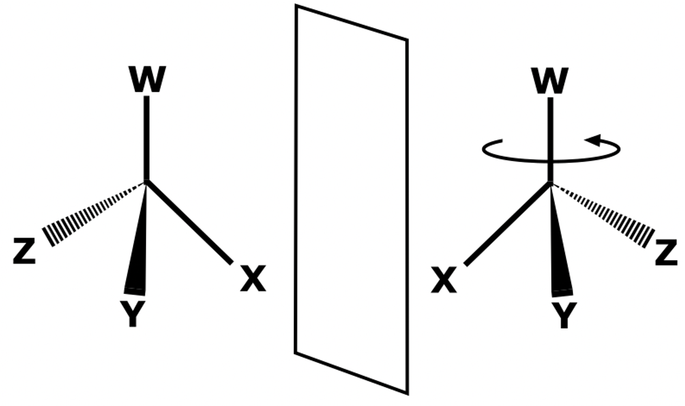
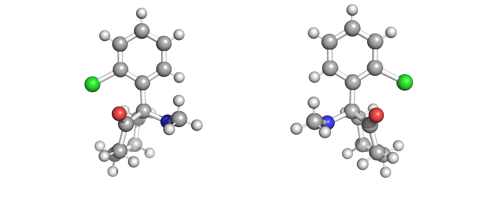

# Background

This project was made in collaboration with Imperial College London's [Institute of Molecular Science and Engineering](https://www.imperial.ac.uk/molecular-science-engineering/) and [BASF](https://www.basf.com). The goal was to develop a software to model solubility diagrams of enantiomers. 

Enantiomers are a type of [stereoisomer](https://en.wikipedia.org/wiki/Stereoisomerism) in which molecules are non-superposable mirror images of each other. We commonly described these structures as the R-enantiomer and its mirror S-enantiomer.

Enantiomers have the same chemical and physical properties under the same environment.